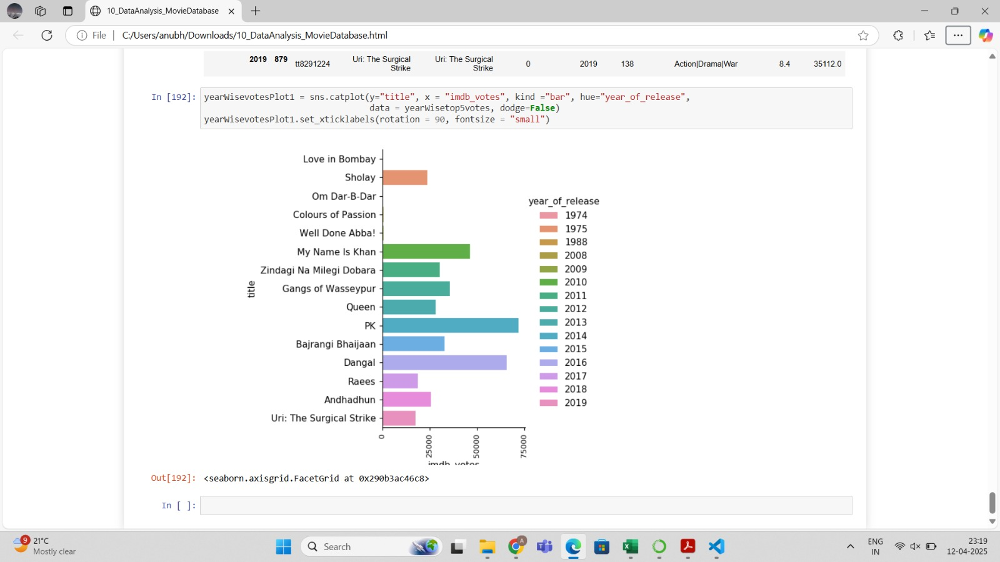

# Bollywood Movies Data Analysis 🎬

.jpg)

I am excited to share my latest data analysis project on Bollywood movies!

Bollywood isn't just entertainment—it's a massive industry full of trends, patterns, and stories hidden in the numbers. Using a comprehensive Bollywood Movies dataset, I explored various aspects of the film industry through the power of Python.

## Key Analysis Areas 📊

This analysis includes:

* 🎭 Exploring the most popular genres across different release periods

* 🔄 Comparing the success of remakes versus original movies
.jpg)

* 💰 Studying the relationship between budget and revenue
.png)

* ⭐ Highlighting the most featured and highest-grossing lead stars
.png)

* 📈 And uncovering some unexpected trends along the way!
.png)

## Technical Stack 🛠️

I used powerful Python libraries to transform raw data into meaningful insights:
- Pandas for data manipulation
- Matplotlib for basic visualizations
- Seaborn for advanced statistical graphics

## Conclusion 🎯

If you're passionate about data or love Bollywood, this project brings both worlds together in a fascinating way. Let the numbers tell the story behind the silver screen!

---

#Bollywood #DataAnalysis #PythonProject #MovieAnalytics #FilmData #BollywoodInsights #DataVisualization #DataScienceJourney #PythonForData
